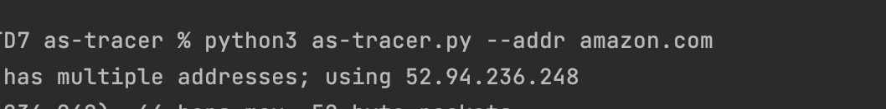
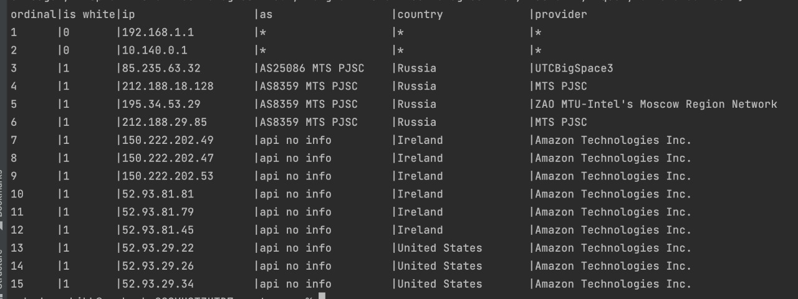

## Трассировка автономных систем

Для работы необходимо запустить скрипт и
и передать в качестве параметра ip адрес, 
либо доменное имя с использованием флага --addr

Результатом выполнения будет таблица вида:

Как работает:
    
    1) Считывается переданный адрес
    2) Выполняется traceroute + переданный адрес
    3) В результате с помощью регулярного выражения ищется ip адреса
    4) Обращаемся к api для получения информации об ip адресе
    5) Выводим результат в виде таблицы
