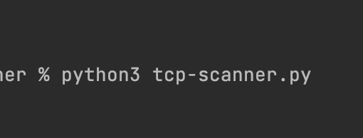
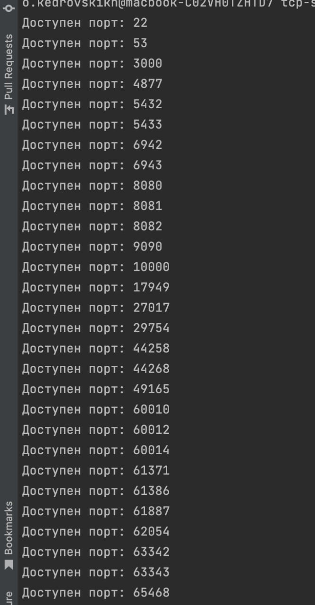

## tcp сканнер

Для работы необходимо передать параметры:

addr - адрес на котором будут сканироваться порты
bottom - нижняя граница прослушиваемых протов
top - верхняя граница прослушиваемых портов

Результат

